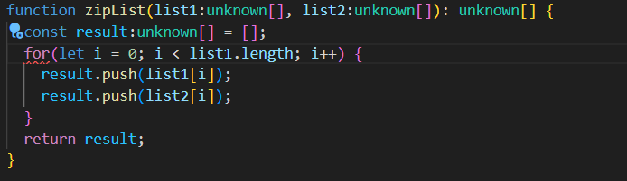
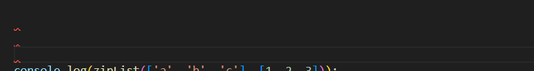

<h1>Coding standard is sometimes frustration!</h1>

Coding standard can sometimes make my feel annoying, reflecting on my first week use of ESLint in VSCode, a red wavy line would occur even though it's just a minor issue, for example, it occurs when I forgot to create a new line at the end of the code or forgot to add a whitespace after the "if" statement, then I have to go back to check what happened and recorrect the mistake, to be honest, in many case I don't think it's necessary to correct them and the small issues would not affect my code, I will feel a distraction from the core logic I'm trying to implement, I cannot get a lot real value from correcting them.But however, I forgot what is the definition real value: consistency, collaboration, and long-term maintainability.

<h1>From Frustration to Growth</h1>
Actually the initial frustration provides an opportunity for me to grow, after the first week using ESLint in VSCode, following the standard in ESLint helped me a lot with writing cleaner and efficient code, for example, I used to leave more than one line after a block of code, which would make the code look decentralized, instead of allowing any types or leaving functions loosely typed, I learned to be more explicit and intentional with my code, coding standard is very important espcially when you are dealing with more than one programming language, good habit will develop using extension like ESLint with typescript language, more importantly, following the discipline in the standard even help me increase problem-solving skills.

<h1>Conclusion</h1>
In summary, coding standard is definitely not a trivial, even though I feel some burdens in the beginning of using tools like ESLint in VSCode, When my code is standard enough, I will naturally see fewer errors, I made a lot of progress during this week, what starts as frustration for me evolves me into a deeper understanding of how high quality software is built, put it simply, how could someone write excellent code if they don't even follow the coding standard?Do you agree?
