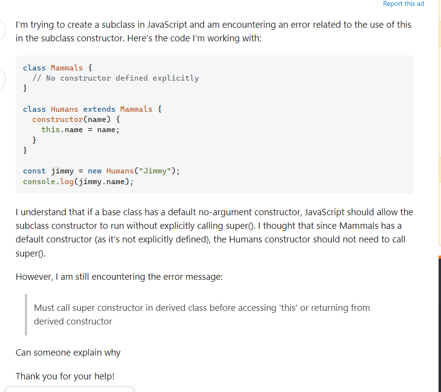
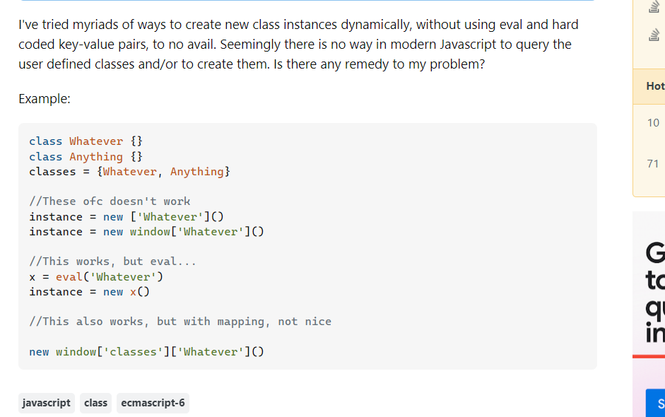

<h1>Communication is very important in software engineering field</h1>

In the realm of software engineering, it's very important to master a skill which is communicating with other in a clear and effective way, which is espcially evident in online communities where collaboration and knowledge sharing are key to solving complex problems. If the question is clearly explained and well constructed, I believe that the quality of question can significantly impact the quality of assistance received. For software engineers, mastering the art of asking smart questions is not just about getting answers but about engaging constructively with other users in the community. This essay explores the significance of asking questions in a smart way by analyzing two examples from StackOverflow, including a good example and a not-so-good example. 

<h1>A good example of Smart Question</h1>

https://stackoverflow.com/questions/78800907/why-am-i-getting-compile-error-in-javascript-when-extending-a-class-with-a-defau, this question was asked in Stack overflow, the largest community for developers in the world, in this question, the author wanted to know why there was a compile error when extending a class with a default constructor in JavaScript, first of all, his question has a clear problem: Why the compile error occured in this case? Other members in the community can see his code attached, which can make it easier to solve the issue, the problem was explained clearly and he also attached the error message: Must call super constructor in derived class before accessing 'this' or returning from derived constructor, all relevant details are given so I think he created a good scenario that other users can offer assistance easily, he also said thank you at the end, which is respectful, so it should be considered as a good example of SMART questions, we can see that another user helped him fix the issue in a short time.  

<h1>An example of Not So Smart question</h1>

https://stackoverflow.com/questions/78797362/javascript-any-way-to-create-a-class-by-constructing-class-name-using-strings-v

First of all, we can see that the question lacks effective netiquette because it fails to demonstrate respect for the community's time and resources, which is not good for him to get the answer, The question about dynamically creating class instances in JavaScript without using eval is less effective due to its lack of clarity and focus. The user said he've tried many times but did not explain why they were all failed or what specific issues were encountered, this makes other users difficult to analyze the problem, resulting in a 0 reply on his question. 

<h1>Summary</h1>

In conclusion, for a software engineering, mastering a skill of how to create effective communications, especially in online communities, is very essential to solove real-world problem. To ask Questions in a Smart Way," we need to provide valuable insights into crafting well-structured questions that facilitate productive responses. This essay uses two examples from StackOverflow.com to illustrate the importance of asking questions in a "smart" versus asking question in a "not-so-smart" way. A well-constructed question,which has clear and efficient support and follow the netiquette will be considered a good question and will get solved easier. Conversely, A question that is non-well-constructed question such as not explaining why the test failed or did not try to illustrate the problemo and does not follow netiquetter will fail to garner useful assistance due to their lack of specificity and engagement with existing solutions. By understanding these examples, software engineers can improve their communication skills, enhancing their interactions with the developer community and ultimately receiving more effective help. Therefore, we need to increase our understanding of how to ask a "smart" instead of a "not-so-smart" question and why would them could improve our interaction with the software engineering community. From the two examples, we've learned the art of asking insightful and well constructed questions and improve our own communication skills in software engineering field.

