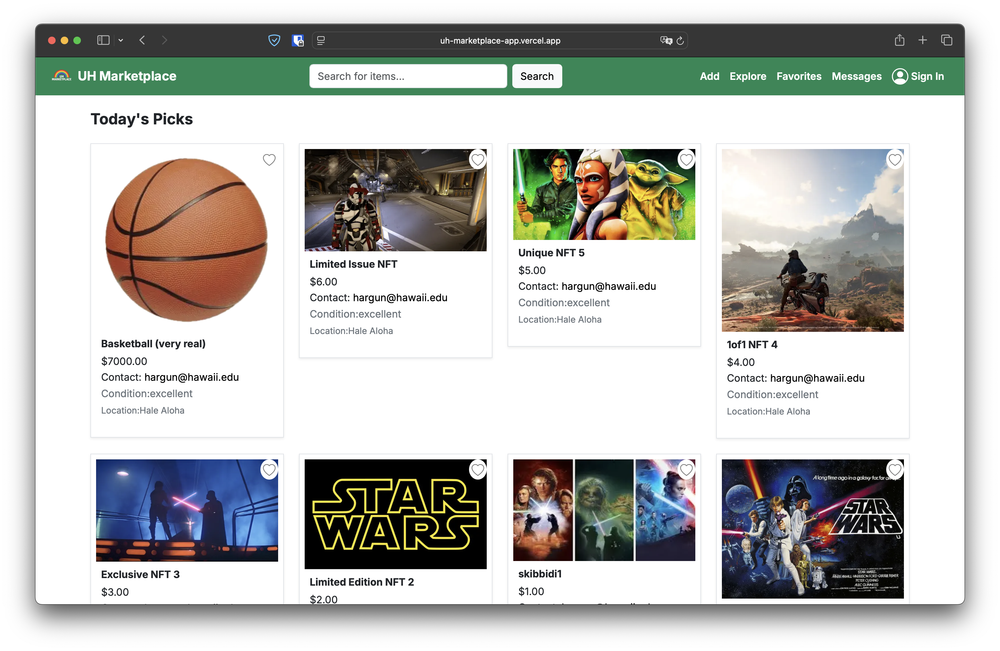
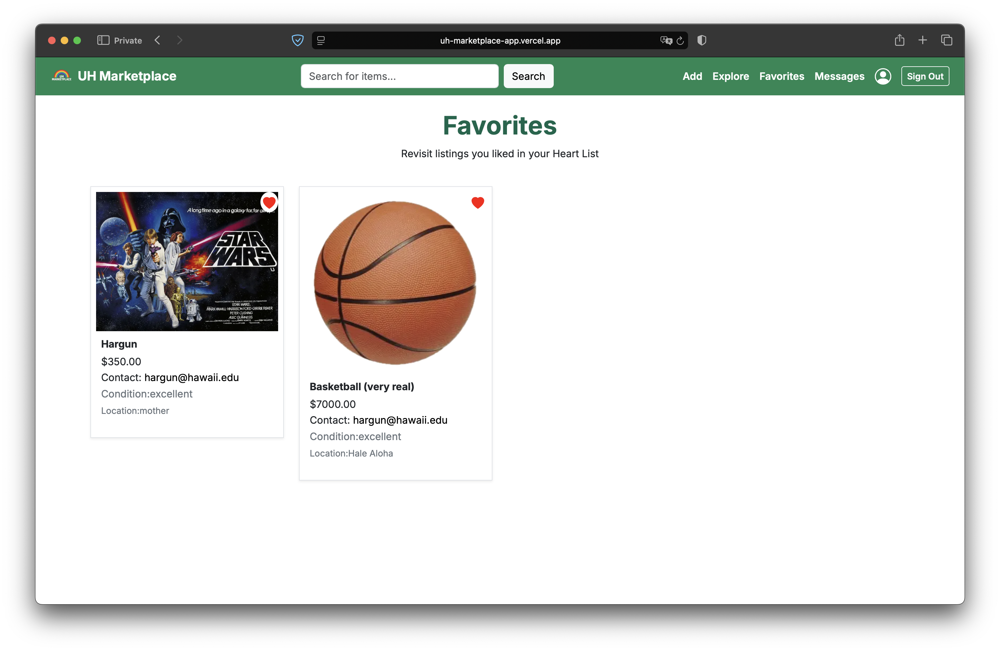

As part of my responsibilities in the UH Marketplace project, I was tasked with building and integrating the **Explore page** and contributing key features to the **Favorites page**, both of which play central roles in the application's user experience.

The **Explore page** is the landing zone for all item listings and dynamically fetches live data from our PostgreSQL database using Prisma. I implemented both the frontend layout and server-side data loading, ensuring all listings displayed up-to-date details including name, image, price, condition, location, contact, and description. To enhance usability, I added filtering features by **category** and **price range**, enabling users to narrow down results quickly and intuitively.

For the **Favorites page**, I designed the mechanism allowing logged-in users to "heart" items to save them for later. This required integrating the heart button UI across listing cards and implementing the backend API logic using Next.js Route Handlers. I also connected it with the session-based `getServerSession` flow to associate favorites with the correct user account. Additionally, I implemented the **unfavorite** functionality, allowing users to remove items from their list, and ensured the client-side interface synced in real time with the database.

Throughout this process, I used React hooks and Bootstrap to maintain a clean and responsive layout. I also collaborated with my team to resolve data consistency issues between Prisma schema definitions and actual app usage, ensuring that item descriptions and contact details were correctly passed through API responses and rendered where needed.

  

    
    
<em>Favorites Page Showing Hearted Items</em>

  

Source code: <a href="https://github.com/uh-marketplace/uh-marketplace-app"><i class="large github icon "></i>uh-marketplace/uh-marketplace-app</a>
 
Organization Homepage: <a href="https://uh-marketplace.github.io/">UH Marketplace</a>